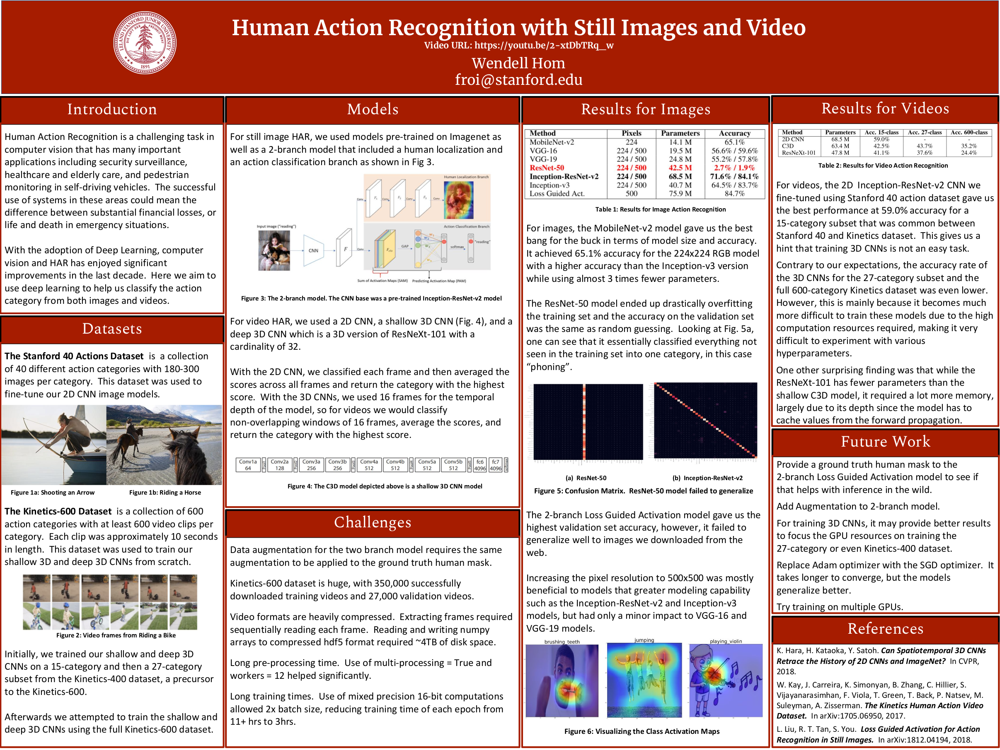

# Human Action Recognition

This is my final project for the CS230 Deep Learning class offered at Stanford.
For this project, I chose to work on human action recognition of still images and videos.

See the poster below for a quick overview.

## Directory

* Code for performing human action recognition on still images located under image_har/
* Code for performing human action recognition on videos are located under video_har/

## Poster

