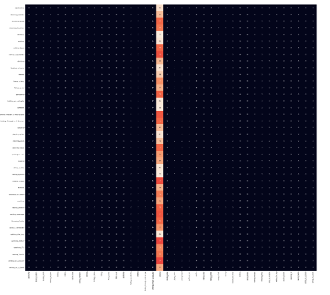
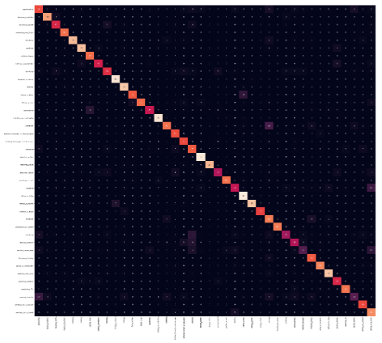
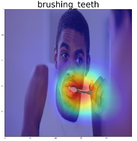
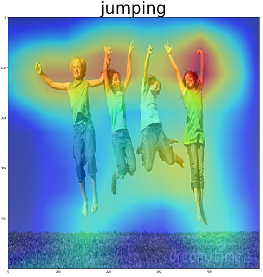
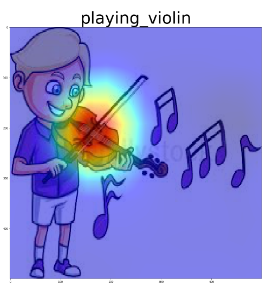

# Still Image Action Recognition using Keras Framework

Image action recognition was initially implemented using the Keras framework, and currently contains a more complete 
account of all models and their results.  On the other hand, the models that were fine-tuned using the pytorch framework currently have accuracy rates that are higher than their Keras counterparts for the same input resolution.

## Confusion Matrix
Below is the confusion matrix for two different models, ResNet-50 on the left, and Inception-ResNet-v2 on the right.

## Class Activity Mapping

The class activation map is shown below for a few images that were run on the InceptionResNet-V2 model.

   
