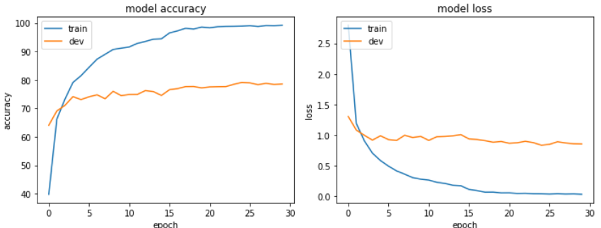
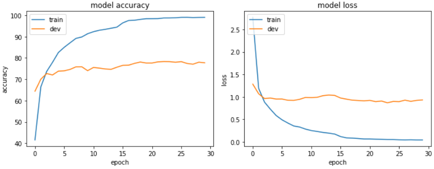

# Human Action Recognition for Still Images

The models trained using pytorch framework appear to be getting higher accuracy. 
Possible differences might be change in 

* batch_size
* framework
* models here do not include the extra Conv2d layer + Global Average Pooling used in the Keras models

## Results

In the table below, pixels represents the spatial resolution of the input to a model.
Training was run with the input set to 224x224 RGB images as well as 500x500 RG images.

  Model        |    Pixels  |   Accuracy
---------------|------------|--------------
ResNet-50      |    224/500 |    82.8% / 88.3%
ResNeXt-50     |    224/500 |        ? / 90.0%
ResNeXt-101    |    224/500 |        ? / ?

## Training Logs

VGG16 training results:

VGG19 training results:

MobileNet-V2 training results:

ResNet-50 training results.  Validation accuracy: 82.8%, strangely a lot better than the version using Keras where the accuracy was as good as guessing.

