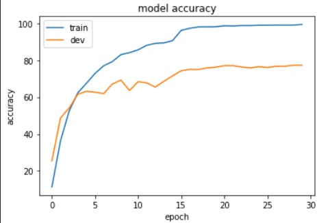
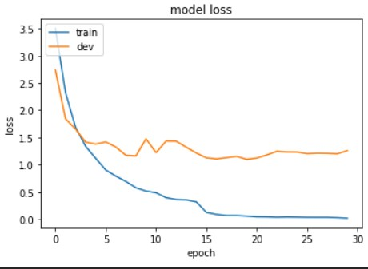

# Human Action Recognition for Still Images

VGG16 training results:

ResNet-50 training results.  Validation accuracy: 82.8%, strangely a lot better than the version using Keras where the accuracy was as good as guessing.

