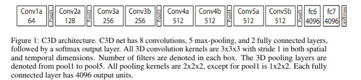

# Human Action Recognition for Videos

For Human Action Recognition with Videos, three different models were evaluated: a 2D CNN, a shallow 3D CNN and a deep 3D CNN.

## Datasets

The dataset for Video Action recognition comes from the Kinetics dataset.
The 15-category and 27-category subsets were originally picked from the Kinetics-400 dataset.
As an extra challenge, the full Kinetics-600 dataset was downloaded with ~350,000 videos training videos downloaded successfully and about 27,000 validation images.  Test images were not labeled, so they were not used here.  Youtube blacklisted my router at least twice, so I needed to use three separate routers to finally get all the categories downloaded.

Videos are highly compressed, to reduce data pipeline latency, these files were uncompressed and stored as h5py files, with one file per category per training + validation set.  i.e., 600 h5py files for training data and 600 h5py files for validation data.  Total disk space required was ~ 4TB.  SSDs were used to keep read latency to a reasonable times.

To keep GPUs from being starved from data, the training code uses `use_multiprocessing= True, num_workers = 12` 

## Models

The 2D CNN model came from the Inception-ResNet-v2 model that was fined tuned on the Stanford 40 action dataset from the still image action recognition of this project.

The 3D shallow CNN is the C3D architecture that was mentioned in the paper by Tran et-el.



The Deep 3D CNN is a 3D version of the ResNeXt-101, a deep 3D CNN that was used in the paper by Hara et-el.


## Mixed precision 16-bit floating point 

To increase batch size and reduce runtime, mixed precision floating point was used for models.

```
tf.keras.mixed_precision.experimental.set_policy('mixed_float16')
```

To avoid numerical underflow and overflow, batchnorm and softmax layers retained the original 32-bit floating point dtype.
This change was most useful for the Deep 3D CNN ResNeXt-101 model which could have fit mini-batch size of 37 in memory on a RTX Titan card with 24 GB of memory.  Turning on mixed-precision allowed up to a mini-batch size of 80 and significantly reduce runtime from 11+ hrs down to 3 hrs for one epoch (just the training examples, validation was run separately)

## Issues

* Tensorflow 2.1 + Keras had a [memory leak](https://github.com/tensorflow/tensorflow/issues/37515) (which is now fixed with  ) but might require manually building tensorflow libraries which may be difficult due to dependencies.  Currently using conda install tensorflow-gpu.
* Tensorflow 2.2 now has the fix, but training seemed slower by a few hrs per epoch when I tried it.
* Currently working around the memory issue by allocating 1.4 TB of disk space as swap. (200-300 GBs is not enough and fills up overnight)


## Results of Validation Set

These runs were done using Adam Optimizer with lr = 0.0001, and reduced to 0.00005 and then 0.00001 when loss saturated.

|               |  15-category  |  27-category  |    600-category
|---------------|---------------| --------------|-----------------
| 2D CNN        |    59.0%      |     -         |       -
| C3D           |    42.5%      |     43.7%     |      35.2%
| ResNeX-t101   |    41.1%      |     37.6%     |      24.4%


## SGD Optimizer

Training using the SGD Optimizer with lr = 0.1, decay = 0.001, and momentum = 0.9 was also launched for the ResNeXt-101 architecture on the full Kinetics-600 dataset.

Accuracy on the validation set is currently at 28.7% on the 48th epoch, at about 3 hrs per epoch.
Will try to reduce learning rate on the 50th epoch.  

## Future Work
* add additional augmentation for the videos.
* try smaller batch sizes to see if that helps with accuracy, but will increase runtime
* try multi-gpu to reduce runtime

